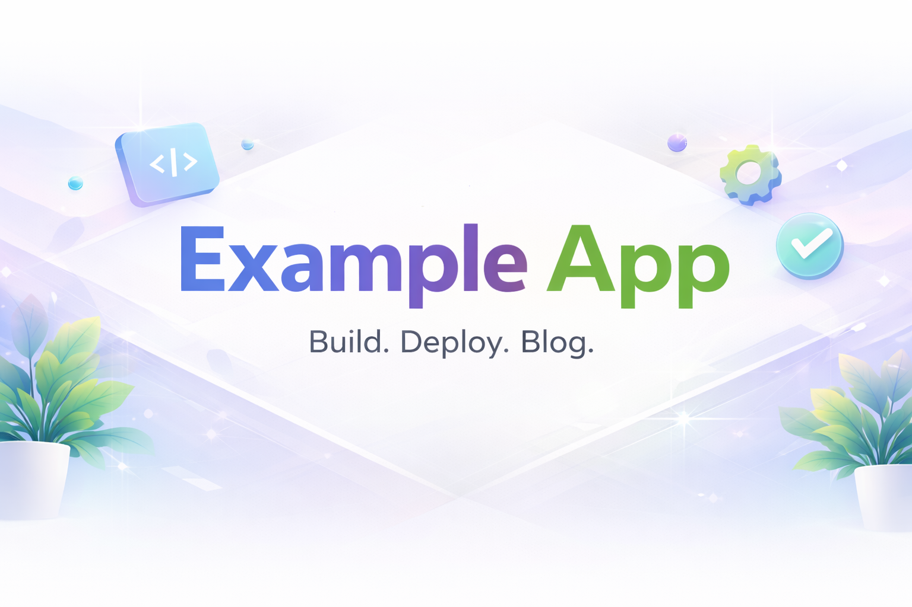

# Example App



<p align="left">
  
  
  
  
  
</p>

A Next.js example application built as a companion to the SlimKat Media blog series.

This repo is intentionally generic so developers can fork it and follow along with the blog series to build a polished, deployed app step by step.

## Links

- Repo: https://github.com/JamesFThomas/example-app
- Live site: https://example-app-eight-silk.vercel.app/
- Blog series: https://medium.com/@jamesfeltonthomas
- LinkedIn: https://www.linkedin.com/in/jamesfeltonthomas/

## Project Overview

This project is a real, deployed Next.js application that evolves alongside a public build series. The goal is to document each milestone as it is completed, including decisions, tradeoffs, and any bugs encountered during implementation.

The SlimKat Media application is the business-specific version. This Example App keeps the same concepts but stays brand-neutral so it can be reused as a starter.

## Tech Stack

- Next.js (App Router)
- React
- TypeScript
- Tailwind CSS
- ESLint

## Local Development

### Prerequisites

- Node.js (LTS recommended)
- npm

## Setup

```bash
git clone https://github.com/JamesFThomas/example-app.git
cd example-app
npm install
npm run dev
```

Open http://localhost:3000.

## Project Structure

The project follows a modular, feature-oriented structure using the Next.js App Router.

```pgsql
app/                 # Next.js routing layer (App Router)
  layout.tsx         # Root layout wrapper
  page.tsx           # Root page entry
  globals.css        # Global styles

components/          # Application UI components
  pages/             # Page-level feature components
    home/
      Home.tsx       # Home feature component
      Home.test.tsx  # Reserved for future testing
  shared/            # Reusable cross-app components
    navbar/
    footer/

public/              # Static assets (images, icons, etc.)

```

## Testing

Will be implemented in bLog 3 of the series.

## Deployment

This application is deployed on Vercel.

- Live site: https://example-app-eight-silk.vercel.app/

## Upcoming Features

### Application Features

- Email subscription confirmation flow (transactional email via Resend)
- Calendar scheduling feature
- Google Calendar API integration
- User authentication and role-based access control
- Session management and secure token handling

### Infrastructure & Platform

- Production database deployment and schema design
- Database integration with authentication layer
- Custom domain configuration and DNS setup (exampleapp.com)
- Domain-verified email delivery (SPF, DKIM, DMARC)
- Branded domain email inboxes (e.g., contact@exampleapp.com)

## Author

#### James Felton Thomas:

- GitHub: https://github.com/JamesFThomas
- LinkedIn: https://www.linkedin.com/in/jamesfeltonthomas/

## License

- MIT
